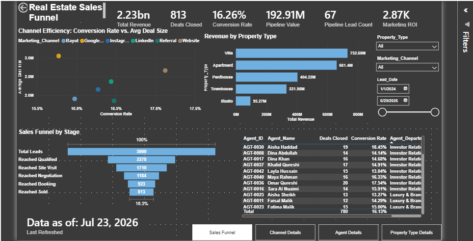
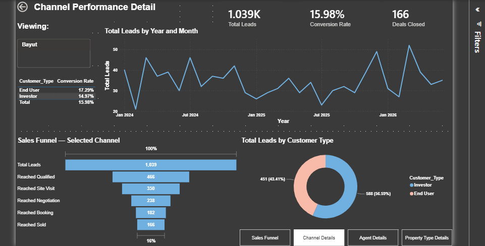
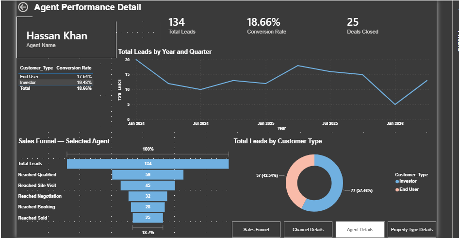
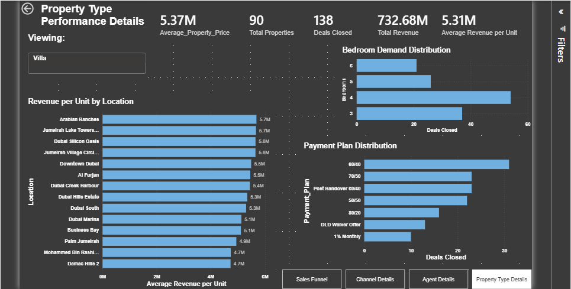

# Real Estate Sales Funnel Analytics — Dubai Property Developer

An end-to-end analytics project analyzing the complete customer journey — from marketing lead generation through to closed sale — for a Dubai-based real estate developer. Built as a full analytics lifecycle: raw CSV data → SQL Server data warehouse (Bronze/Silver Medallion architecture) → a live, interactive Power BI dashboard.

Every figure in the final dashboard is independently verified against SQL — this project emphasizes not just building a dashboard, but proving the numbers behind it are correct.

## Tools & Technologies
- **SQL Server** — Bronze/Silver data warehouse layers, `BULK INSERT`, window functions (`ROW_NUMBER`, `RANK`), CTEs
- **Power BI Desktop** — data modeling, DAX measures, drill-through pages, Power Query (M)
- **Power Query** — data cleaning, type validation, table appending

## Data Journey
```
Raw CSVs (Leads, Customers, Properties, Agents, Sales)
        ↓
Bronze Layer (SQL Server) — raw, text-typed, audit-tracked
        ↓
Silver Layer — cleaned, typed, business-rule validated
        ↓
Power BI — live-connected data model, verified DAX, interactive dashboard
```

## Dataset Scale
- 5,000 Leads | 5,000 Customers | 600 Properties | 45 Agents | 813 Sales

## Key Business Findings

1. **54.44% of leads are lost before reaching "Qualified"** — the single largest funnel leak, identified by testing (and disproving) an initial hypothesis about where the drop-off occurs.
2. **Win Rate of 68.67%** once a deal reaches serious negotiation — confirms the sales team closes well; the real problem is upstream lead engagement, not sales execution.
3. **Referral delivers the best marketing ROI (~16,500x)** but the lowest average deal size — an efficiency channel, not a premium one.
4. **A genuine ~2x performance gap** exists between the best and worst sales agents, even controlling for customer segment mix.
5. **Villas generate the highest total revenue; Penthouses the highest value per unit; Studios underperform on every metric.**
6. **A data integrity discovery:** two different sales agents share the same name in the dataset — a concrete real-world example of why unique IDs, not display names, must anchor any performance reporting.

## Dashboard Pages

### Executive Overview
KPI cards (Revenue, Deals Closed, Conversion Rate, Pipeline Value, Marketing ROI), sales funnel, marketing channel efficiency scatter plot, and global slicers (Date, Channel, Property Type).



### Channel Details (drill-through)
Per-channel funnel, customer segment breakdown, and monthly trend — filtered to whichever marketing channel is selected.



### Agent Details (drill-through)
Built on `Agent_ID` specifically (not `Agent_Name`) to correctly separate two different agents who happen to share the same name — a real data integrity issue found during this build.



### Property Type Details (drill-through)
Location, payment plan, and bedroom distribution by property type — with location performance deliberately controlled for property-type mix to avoid a confounding "luxury unit concentration" bias.



## Verification Discipline

A core theme of this project: every number was checked against an independent source before being trusted. This caught several real issues along the way, including:
- A duplicate-property-sale data quality issue, resolved via `ROW_NUMBER()` rather than silent deletion
- A Power BI relationship auto-detection bug that silently deactivated a critical table relationship
- A DAX filter-direction bug in the Pipeline Value measure, fixed using `SUMX`/`RELATED()`
- Two leftover dashboard slicer selections that silently distorted numbers during final polish

## Repository Structure
```
├── README.md
├── sql/
│   ├── 01_bronze_layer_setup.sql
│   ├── 02_silver_layer_transform.sql
│   ├── 03_analysis_queries.sql
├── data/
│   ├── Leads.csv, Customers.csv, Properties.csv, Agents.csv, Sales.csv
├── powerbi/
│   ├── real_estate_dashboard.pbix
├── docs/
│   ├── data_dictionary.md
│   ├── kpi_definitions.md
│   ├── business_insights_report.md
├── screenshots/
│   ├── executive_overview.png, channel_details.png, agent_details.png, property_type_details.png
```

## KPI Definitions (Summary)

| KPI | Formula |
|---|---|
| Conversion Rate | Sold ÷ Total Leads |
| Win Rate | Sold ÷ Opportunities (leads reaching Negotiation) |
| CPL | Total Marketing Cost ÷ Total Leads |
| CAC | Total Marketing Cost ÷ Sold Leads |
| Pipeline Value | Sum of list price for leads in Qualified/Site Visit/Negotiation/Booking |
| Marketing ROI | Total Revenue ÷ Total Marketing Cost |
| Sales Cycle | Average days from Lead_Date to Sale_Date |

Full detail in [`docs/kpi_definitions.md`](docs/kpi_definitions.md).

## Further Reading
- [Data Dictionary](docs/data_dictionary.md)
- [KPI Definitions](docs/kpi_definitions.md)
- [Full Business Insights Report](docs/business_insights_report.md)
